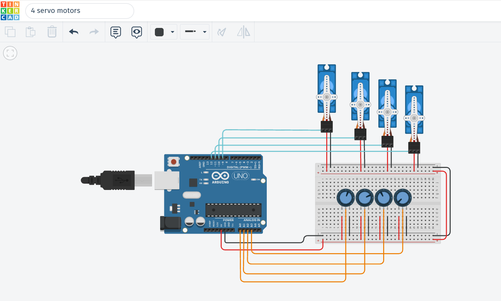

# 🤖 4-Servo Motor Sweep Control

A simple Arduino project that controls four servo motors simultaneously. The motors perform a sweep movement for two seconds, then move to and hold at the 90° position.

---

## 📷 Project Preview & Video Demonstration

> 🎥 **Click the image above** or [Watch on YouTube](https://www.youtube.com/watch?v=YOUR_VIDEO_ID) to see the project demonstration!

---

## 🛠️ Components Used  
- Arduino Uno
- 4 × Servo Motors
- Jumper Wires

---

## ⚙️ How It Works

1. Four servo motors are connected to an Arduino Uno.
2. All motors perform a sweep movement between **0° and 180°**.
3. The sweep movement runs for **2 seconds**.
4. After 2 seconds, all four motors move to **90°**.
5. The motors remain fixed at the 90° position.

---

## 🚀 How to Run

1. Open [Tinkercad](https://www.tinkercad.com/) or Arduino IDE.
2. Connect the components as shown in the **Pin Connections** table.
3. Upload `servo_motors.ino` and click **Start Simulation**.

---

## 🔌 Pin Connections

| Servo Motor | Arduino Pin |
|-------------|-------------|
| Motor 1     | Pin 9       |
| Motor 2     | Pin 10      |
| Motor 3     | Pin 11      |
| Motor 4     | Pin 12      |

---

## 💻 Technologies Used

- Arduino
- C/C++
- Servo Library
- Tinkercad

---

## ✨ Features

- Simultaneous control of four servo motors.
- Automated sweep motion.
- Precise 2-second movement duration.
- Automatic positioning at 90°.
- Motors remain stable after reaching the final position.

---

## 📁 Project Files

- `servo_motors.ino` — Arduino source code.
- `servo_motors.png` — Project circuit preview image.
